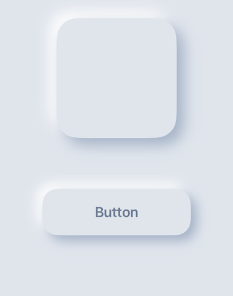

# NeumorphicUIKit

[](https://github.com/A-bv/NeumorphicUIKit/actions/workflows/ci.yml)
[](https://swift.org/package-manager/)
[](https://developer.apple.com/ios/)
[](https://swift.org)
[](LICENSE)

Add a soft, "raised" neumorphic look to any UIKit view — cards, buttons, any
control — using your own colors.



## What it does
- Styles any `UIView`, including buttons and other controls.
- Uses the colors you give it, so it matches your app.
- Keeps itself correct when the user switches between light and dark mode.
- Has a pressed look for buttons.

## Requirements
iOS 15+ · Swift 5.9

## Installation
In Xcode: **File → Add Package Dependencies…**, then paste:

```
https://github.com/A-bv/NeumorphicUIKit
```

Or add it to `Package.swift`:

```swift
.package(url: "https://github.com/A-bv/NeumorphicUIKit", from: "3.2.1")
```

## Usage
Set your colors once, when the app starts (for example in the app delegate):

```swift
Neumorphism.configure(NeumorphicColors(
    surface: .myBackground,   // the view's own color
    darkShadow: .myDarkShadow, // the darker edge
    lightShadow: .myLightShadow, // the lighter edge
    bottom: .myBottom))       // used for the pressed look
```

Then style any view:

```swift
card.neumorphism(cornerRadius: 16)
```

That's it. The view keeps its look correct when the user switches between light
and dark mode — you don't have to do anything else.

For that automatic light/dark switch to show, pass dynamic `UIColor`s — ones
with light and dark variants (`UIColor { $0.userInterfaceStyle == .dark ? … : … }`
or a color set in your asset catalog) — to `configure`.

### Buttons
Add the pressed look by forwarding a button's touch events:

```swift
button.neumorphism(cornerRadius: 16)
button.addTarget(self, action: #selector(down), for: .touchDown)
button.addTarget(self, action: #selector(up), for: [.touchUpInside, .touchUpOutside, .touchCancel])
```

```swift
@objc func down(_ sender: UIView) { sender.pressDown() }
@objc func up(_ sender: UIView)   { sender.pressUp(settle: true) }
```

### Views that change size
The look is built at the view's current size. If a view resizes — an Auto Layout
view, or a button whose title grows — keep the look matched to it. From the view
controller that owns it:

```swift
override func viewDidLayoutSubviews() {
    super.viewDidLayoutSubviews()
    card.resizeNeumorphicShadows()
}
```
